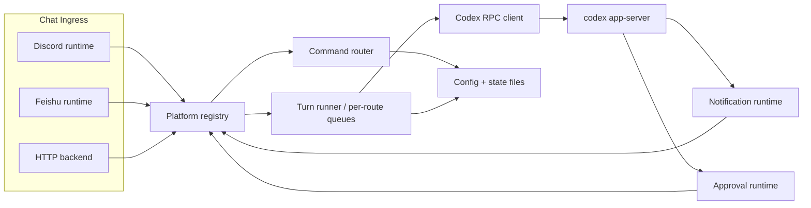
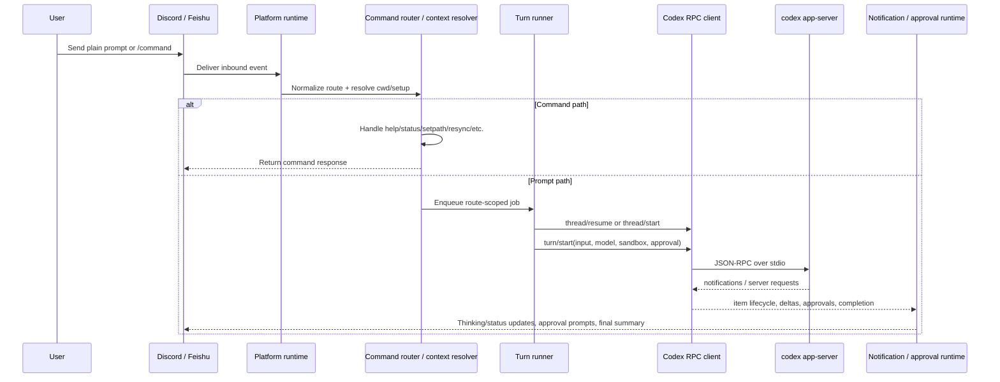

# Codex Chat Bridge

[](https://youtu.be/RRF-F5jDS50)

Long-running Codex backend bridge for Discord and Feishu. It starts `codex app-server` on the host, binds chat routes to persistent Codex threads, and exposes standard health endpoints for service deployment.

## Overview

- Discord project channels are auto-discovered from Codex `thread/list` and managed under a category.
- Discord supports plain text prompts, image attachments, legacy `!commands`, and slash commands.
- Feishu supports mapped chats through either webhook callbacks or long-connection transport, with the same command routing.
- One chat route maps to one persistent Codex thread.
- Each route runs turns serially, so one channel/chat cannot overlap turns.
- The bridge can run in the foreground, behind a restart supervisor, as a macOS `launchd` agent, or as a Linux `systemd` service.
- A standard HTTP backend exposes `/healthz`, `/readyz`, and optionally `/feishu/events` when Feishu webhook mode is enabled.

## System Architecture



### Core Runtime Layers

| Layer | Primary files | Responsibility |
| --- | --- | --- |
| Process bootstrap | `src/index.js`, `src/app/mainRuntime.js`, `src/app/runBridgeProcess.js` | Loads env/config/state, wires services, starts/stops the bridge |
| Platform abstraction | `src/platforms/platformRegistry.js`, `src/platforms/discordPlatform.js`, `src/platforms/feishuPlatform.js` | Normalizes platform capabilities, route lookup, startup, HTTP ingress, and shutdown |
| Command and route management | `src/commands/router.js`, `src/channels/bootstrapService.js` | Parses commands, mutates route bindings, manages Discord auto-discovery, persists route changes |
| Codex transport | `src/codexRpcClient.js` | Starts `codex app-server`, sends JSON-RPC requests, receives notifications and server requests |
| Turn execution | `src/codex/turnRunner.js` | Maintains one FIFO queue per route, resumes/starts threads, retries transient reconnects, stores thread bindings |
| Output rendering | `src/turns/notificationRuntime.js`, `src/render/messageRenderer.js` | Turns Codex deltas, lifecycle items, diffs, and summary output into chat messages |
| Approval handling | `src/approvals/serverRequestRuntime.js` | Handles command/file approval requests, approval buttons, and unsupported tool-call fallbacks |
| HTTP/service ops | `src/backend/httpRuntime.js`, `src/app/runtimeOps.js`, `src/cli/**` | Health endpoints, heartbeat/restart files, operator CLI, service integration |

### Startup Sequence

1. Load `.env`, `config/channels.json`, and `data/state.json`.
2. Start the backend HTTP server if enabled.
3. Start `codex app-server` and finish the `initialize` handshake.
4. Start enabled platforms through the platform registry.
5. Register Discord slash commands if Discord is enabled.
6. Start Feishu transport in webhook or long-connection mode if Feishu is enabled.
7. Reconcile any in-flight turn recovery state.
8. Bootstrap Discord managed project channels from Codex `thread/list`.
9. Start heartbeat writes and mark `/readyz` healthy.

## End-to-End Flow



### Prompt Lifecycle

1. A platform runtime receives an inbound message or command event.
2. The route is resolved to a setup with `cwd`, model, mode, and write policy.
3. Command messages are handled immediately by the shared command router.
4. Prompt messages are queued by route, so one chat never runs overlapping turns.
5. The turn runner resumes or starts a Codex thread for that route.
6. `turn/start` is sent to `codex app-server` with model, sandbox, and approval policy.
7. Notifications stream back into the notification runtime, which renders status, summaries, diffs, and attachments.
8. Approval requests are intercepted by the approval runtime and sent back to the originating route.
9. On success or failure, the route's current thread binding is persisted for the next message.

## Supported Route Types

| Platform | Route type | How it is created | Write mode | Notes |
| --- | --- | --- | --- | --- |
| Discord | Managed repo text channel | Auto-discovered from Codex `cwd`, or bound with `!initrepo` | Writable by default | Plain text messages become prompts |
| Discord | `#general` | Existing text channel matched by ID or name | Read-only | Useful for discussion and planning |
| Feishu | Mapped repo chat | Explicit `feishu:<chat_id>` entry in `config/channels.json` | Writable by default | Text only |
| Feishu | General chat | `FEISHU_GENERAL_CHAT_ID` | Read-only | Similar to Discord `#general` |

## Capability Summary

| Capability | Discord | Feishu |
| --- | --- | --- |
| Persistent Codex thread per route | Yes | Yes |
| In-chat route rebinding | `!setpath`, `/setpath` | `/setpath` |
| Auto-discover routes from Codex `cwd` | Yes | No |
| Auto-create/manage chat containers | Yes | No |
| Native slash commands | Yes | No |
| Text `/command` style input | No | Yes |
| Approval buttons | Yes | No |
| Text approval commands | Yes | Yes |
| Image input bridging | Yes | No |
| Read-only general chat mode | Yes | Yes |
| Webhook-less transport | N/A | Yes, `FEISHU_TRANSPORT=long-connection` |

## Runtime Model

### Route Binding Model

- A route is the stable chat identifier the bridge uses internally.
- Discord routes use the raw text channel id.
- Feishu routes use `feishu:<chat_id>`.
- Each route resolves to one setup object: `cwd`, `model`, mode, and write policy.
- Each route also maps to one persistent Codex thread binding in `data/state.json`.

### Execution Model

- Every route has its own FIFO queue.
- Only one turn per route runs at a time.
- The bridge tries `thread/resume` before `thread/start`, so the same chat keeps context.
- If the `cwd` for a route changes, the old thread binding is cleared and the next prompt starts fresh in the new working directory.

### Platform Model

- The platform registry is the boundary between core bridge logic and chat integrations.
- Discord and Feishu declare capabilities such as attachments, buttons, repo bootstrap, auto-discovery, and webhook ingress.
- Shared code asks for capabilities instead of branching on platform names whenever possible.

## Quick Start

### Requirements

- Bun `1.2+`
- Node.js `20+` if you use `bun run start:backend`, `launchd`, or `systemd`
- `codex` CLI installed on the host and already authenticated
- At least one chat platform configured:
  - Discord bot token with `MESSAGE CONTENT INTENT` enabled
  - or Feishu app credentials with `im.message.receive_v1` event subscription enabled for either webhook or long-connection mode

### Install

```bash
bun install
cp .env.example .env
cp config/channels.example.json config/channels.json
```

### Minimal Discord-only `.env`

```bash
DISCORD_BOT_TOKEN=replace-me
DISCORD_ALLOWED_USER_IDS=123456789012345678
DISCORD_REPO_ROOT=/Users/you/projects
BACKEND_HTTP_ENABLED=1
BACKEND_HTTP_HOST=127.0.0.1
BACKEND_HTTP_PORT=8788
```

`DISCORD_GUILD_ID` is optional when the bot is in exactly one guild. If the bot belongs to multiple guilds, set it explicitly.

### Minimal Feishu-only `.env`

```bash
FEISHU_APP_ID=cli_xxx
FEISHU_APP_SECRET=replace-me
# Optional; defaults to webhook. Set to long-connection to avoid callback URLs.
# FEISHU_TRANSPORT=long-connection
```

Optional hardening and routing overrides:

```bash
# FEISHU_VERIFICATION_TOKEN=replace-me
# FEISHU_ALLOWED_OPEN_IDS=ou_xxx
# BACKEND_HTTP_HOST=0.0.0.0
# BACKEND_HTTP_PORT=8788
# FEISHU_WEBHOOK_PATH=/feishu/events
```

Feishu repo chats do not auto-discover. Add `feishu:<chat_id>` mappings to `config/channels.json`.

Transport notes:

- `FEISHU_TRANSPORT=webhook` is the default and requires a reachable callback URL.
- `FEISHU_TRANSPORT=long-connection` connects out to Feishu over WebSocket and does not require a public callback URL.

### Start Modes

Foreground:

```bash
bun run start
```

Proxy-aware backend wrapper, recommended for long-running service mode:

```bash
bun run start:backend
```

`start:backend` loads `.env`, applies `HTTP_PROXY` or `HTTPS_PROXY` to HTTP and WebSocket traffic, then starts the normal bridge entrypoint.

### Verify

```bash
bun run cli doctor
bun run cli status
curl http://127.0.0.1:8788/healthz
curl -i http://127.0.0.1:8788/readyz
```

## Talking to the Bridge

### Discord

- Managed repo channels accept plain text messages as prompts.
- `!ask <prompt>` does the same thing explicitly.
- Slash commands are registered on startup and route to the same command handler.
- Image attachments are forwarded into Codex turns.
- `#general` stays read-only even if the bridge can write inside repo channels.
- `!initrepo` creates and binds a repo under `DISCORD_REPO_ROOT`.

### Feishu

- Only mapped chats or the configured Feishu general chat are accepted.
- Plain text in a mapped repo chat is treated as a prompt.
- Commands use leading slash text such as `/status`, `/ask`, `/approve`.
- `/setpath /absolute/path` rebinds the current chat to an existing repo path and clears the old Codex thread binding.
- In group chats, plain prompts require `@bot` when `FEISHU_REQUIRE_MENTION_IN_GROUP=1`.
- Feishu is currently text-only. Incoming image attachments are not bridged.
- `!initrepo` is not supported on Feishu. Chat bindings stay config-driven.
- `/where` works even before a chat is bound and returns `chat_id`, `route_id`, and `sender_open_id` for setup.
- `FEISHU_TRANSPORT=long-connection` skips callback URLs and receives events over WebSocket instead.

## Command Reference

| Command | Discord `!` | Discord `/` | Feishu text | Notes |
| --- | --- | --- | --- | --- |
| Help | `!help` | `/help` | `/help` | Show usage and current command set |
| Ask | `!ask <prompt>` | `/ask prompt:<text>` | `/ask <prompt>` | Repo channel or mapped chat |
| Status | `!status` | `/status` | `/status` | Queue depth, thread, sandbox, mode |
| New thread | `!new` | `/new` | `/new` | Clears current Codex thread binding |
| Restart | `!restart [reason]` | `/restart` | `/restart [reason]` | Requires supervisor/service to act on restart file |
| Interrupt | `!interrupt` | `/interrupt` | `/interrupt` | Interrupts current turn |
| Where | `!where` | `/where` | `/where` | Shows cwd, state path, thread binding; on Feishu it also helps discover identifiers before binding |
| Set path | `!setpath <abs-path>` | `/setpath path:<abs-path>` | `/setpath <abs-path>` | Rebinds the current chat to an existing repo path and clears the current Codex thread binding |
| Approve | `!approve [id]` | `/approve [id]` | `/approve [id]` | Uses latest pending approval if no id |
| Decline | `!decline [id]` | `/decline [id]` | `/decline [id]` | Same routing rules as approve |
| Cancel | `!cancel [id]` | `/cancel [id]` | `/cancel [id]` | Same routing rules as approve |
| Init repo | `!initrepo [force]` | `/initrepo` | Not supported | Discord only, requires `DISCORD_REPO_ROOT` |
| Resync | `!resync` | `/resync` | `/resync` | Re-syncs Discord managed channels |
| Rebuild | `!rebuild` | `/rebuild` | `/rebuild` | Recreates managed Discord project channels |

Approval buttons are available on Discord when approvals are enabled.

## Approvals and Sandbox

- Default approval policy is `never`.
- Default sandbox mode is `workspace-write`.
- Repo channels and mapped Feishu chats inherit the configured sandbox mode.
- Discord `#general` and Feishu general chat force `read-only` mode and disable file writes.
- If you want interactive approvals, set `CODEX_APPROVAL_POLICY` to `untrusted`, `on-failure`, or `on-request`.
- Unsupported dynamic tool-call requests are rejected with a fallback response.

## Configuration Files

### `.env`

Use `.env.example` as the exhaustive reference. The most important variables are:

| Variable | Purpose |
| --- | --- |
| `DISCORD_BOT_TOKEN` | Enables Discord runtime |
| `DISCORD_GUILD_ID` | Pins one guild when the bot belongs to multiple guilds |
| `DISCORD_ALLOWED_USER_IDS` | Comma-separated Discord allowlist |
| `DISCORD_REPO_ROOT` | Base path used by `!initrepo` |
| `DISCORD_GENERAL_CHANNEL_ID` | Optional explicit read-only general channel |
| `DISCORD_GENERAL_CHANNEL_NAME` | Fallback general channel name, default `general` |
| `FEISHU_APP_ID` | Enables Feishu runtime with app secret |
| `FEISHU_APP_SECRET` | Feishu tenant credential |
| `FEISHU_TRANSPORT` | `webhook` (default) or `long-connection` |
| `FEISHU_VERIFICATION_TOKEN` | Optional webhook validation token for incoming Feishu callbacks |
| `FEISHU_ALLOWED_OPEN_IDS` | Optional comma-separated Feishu allowlist |
| `FEISHU_GENERAL_CHAT_ID` | Optional read-only Feishu general chat |
| `FEISHU_REQUIRE_MENTION_IN_GROUP` | Require mention for plain prompts in group chats |
| `BACKEND_HTTP_ENABLED` | Forces backend HTTP server on; enabled automatically when Feishu is configured |
| `BACKEND_HTTP_HOST` | Optional backend bind address, default `0.0.0.0` |
| `BACKEND_HTTP_PORT` | Optional backend bind port, default `8788` |
| `FEISHU_WEBHOOK_PATH` | Optional webhook route path, default `/feishu/events`; only used in webhook mode |
| `CODEX_BIN` | Path to `codex` executable |
| `CODEX_HOME` | Optional Codex home override |
| `CODEX_APPROVAL_POLICY` | `untrusted`, `on-failure`, `on-request`, or `never` |
| `CODEX_SANDBOX_MODE` | `read-only`, `workspace-write`, or `danger-full-access` |
| `CODEX_EXTRA_WRITABLE_ROOTS` | Extra writable roots for worktrees or tool state |
| `CHANNEL_CONFIG_PATH` | `config/channels.json` override |
| `STATE_PATH` | Thread-binding state file path |
| `DISCORD_HEARTBEAT_PATH` | Heartbeat JSON file path |
| `DISCORD_STDOUT_LOG_PATH` | CLI log override for stdout |
| `DISCORD_STDERR_LOG_PATH` | CLI log override for stderr |
| `HTTP_PROXY` / `HTTPS_PROXY` | Optional upstream proxy for Discord/Codex web traffic |

### `config/channels.json`

`config/channels.json` is optional, but it becomes the source of truth for:

- fixed channel/chat bindings
- model overrides
- access control defaults
- approval/sandbox defaults
- turning auto-discovery on or off
- persistent manual route rebindings made with `setpath`

Example:

```json
{
  "autoDiscoverProjects": true,
  "defaultModel": "gpt-5.3-codex",
  "defaultEffort": "medium",
  "approvalPolicy": "never",
  "sandboxMode": "workspace-write",
  "allowedUserIds": ["123456789012345678"],
  "allowedFeishuUserIds": ["ou_xxxxxxxxxxxxxxxxx"],
  "channels": {
    "123456789012345678": {
      "cwd": "/absolute/path/to/discord/repo",
      "model": "gpt-5.3-codex"
    },
    "feishu:oc_xxxxxxxxxxxxxxxxx": {
      "cwd": "/absolute/path/to/feishu/repo",
      "model": "gpt-5.3-codex"
    }
  }
}
```

Route key rules:

- Discord route key: raw text channel id
- Feishu route key: `feishu:<chat_id>`

Env precedence:

- `DISCORD_ALLOWED_USER_IDS` overrides `allowedUserIds`
- `FEISHU_ALLOWED_OPEN_IDS` overrides `allowedFeishuUserIds`
- `CODEX_APPROVAL_POLICY` overrides `approvalPolicy`
- `CODEX_SANDBOX_MODE` overrides `sandboxMode`

## State and Persistence

| File | Purpose |
| --- | --- |
| `config/channels.json` | Static route mappings, default model/approval/sandbox config, manual `setpath` updates |
| `data/state.json` | Route -> Codex thread bindings |
| `data/bridge-heartbeat.json` | Liveness/heartbeat metadata used by `cli status` |
| `data/restart-request.json` | Requested restarts from chat/CLI |
| `data/restart-ack.json` | Supervisor acknowledgement of a restart request |
| `data/restart-discord-notice.json` | Deferred restart notice bookkeeping |
| `data/inflight-turns.json` | Recovery metadata for active turns across restarts |

Practical distinction:

- `config/channels.json` answers "which repo should this route use?"
- `data/state.json` answers "which Codex thread is this route currently talking to?"

## Backend HTTP

Endpoints:

- `GET /` returns a small service descriptor and enabled endpoint list
- `GET /healthz` returns liveness, queue counts, approval counts, and mapped-channel count
- `GET /readyz` returns `200` only after Codex and configured chat runtimes finish startup
- `POST /feishu/events` handles Feishu event callbacks when `FEISHU_TRANSPORT=webhook`

Typical bind config:

```bash
BACKEND_HTTP_ENABLED=1
BACKEND_HTTP_HOST=0.0.0.0
BACKEND_HTTP_PORT=8788
FEISHU_WEBHOOK_PATH=/feishu/events
```

If you switch to long-connection mode, health endpoints still work, but `/feishu/events` is no longer registered.

## Feishu Setup Walkthrough

This is the shortest reliable way to bring Feishu online with the current bridge.

1. Create a Feishu app in the Feishu Open Platform.
   Use a bot-capable app that can receive message events and send replies in chats.

2. Choose the Feishu event transport.
   The bridge supports:
   - `webhook` (default): Feishu pushes HTTP callbacks to your bridge
   - `long-connection`: the bridge opens a WebSocket to Feishu and receives events without a callback URL

3. Subscribe to message receive events.
   The bridge expects `im.message.receive_v1` in either transport mode.

4. Fill the Feishu env vars in `.env`.
   At minimum:

   ```bash
   FEISHU_APP_ID=cli_xxx
   FEISHU_APP_SECRET=replace-me
   ```

   Optional transport selector:

   ```bash
   # webhook is the default
   FEISHU_TRANSPORT=long-connection
   ```

   Optional but recommended for public webhook deployments:

   ```bash
   FEISHU_VERIFICATION_TOKEN=replace-me
   FEISHU_ALLOWED_OPEN_IDS=ou_xxxxxxxxxxxxxxxxx
   ```

   Optional bind overrides:

   ```bash
   BACKEND_HTTP_HOST=0.0.0.0
   BACKEND_HTTP_PORT=8788
   ```

5. If you chose webhook mode, configure the callback URL.
   Set the callback URL to your externally reachable backend address plus the webhook path.
   Example:

   ```text
   https://your-bridge.example.com/feishu/events
   ```

   If the bridge only runs on your laptop, expose it with a reverse proxy or tunnel first.

6. If you chose long-connection mode, enable persistent connection delivery in Feishu.
   In the Feishu developer console, set the event subscription mode to long connection / persistent connection for the app.
   No callback URL is required in this mode.

7. Start or restart the bridge.

   ```bash
   bun run cli restart "enable feishu"
   ```

8. Add the Feishu bot into the target chat.
   For a group chat, make sure the app is available to the users who need it.

9. Discover the identifiers from inside Feishu.
   In the target chat, send:

   ```text
   /where
   ```

   The bridge will reply with:
   - `chat_id`
   - `route_id`
   - `sender_open_id`

10. Bind the chat in `config/channels.json`.
   Use the `route_id` from `/where` as the key.

   Example:

   ```json
   {
     "channels": {
       "feishu:oc_xxxxxxxxxxxxxxxxx": {
         "cwd": "/absolute/path/to/repo",
         "model": "gpt-5.3-codex"
       }
     }
   }
   ```

11. Restrict access with `FEISHU_ALLOWED_OPEN_IDS` if you want an allowlist.
   Use the `sender_open_id` returned by `/where`.

   Example:

   ```bash
   FEISHU_ALLOWED_OPEN_IDS=ou_xxxxxxxxxxxxxxxxx
   ```

12. Restart again after editing `.env` or `config/channels.json`.

    ```bash
    bun run cli restart "update feishu mappings"
    ```

13. Verify the runtime.

    ```bash
    bun run cli status
    curl http://127.0.0.1:8788/healthz
    curl -i http://127.0.0.1:8788/readyz
    ```

14. Test from Feishu.
    In a bound repo chat:
    - send plain text to create a prompt
    - or use `/status`, `/ask ...`, `/where`

### Feishu Identifier Notes

- `chat_id` is the raw Feishu chat identifier.
- `route_id` is the bridge key format: `feishu:<chat_id>`.
- `sender_open_id` is the user identifier used by `FEISHU_ALLOWED_OPEN_IDS`.
- `FEISHU_TRANSPORT=webhook` needs a callback URL; `FEISHU_TRANSPORT=long-connection` does not.
- `FEISHU_VERIFICATION_TOKEN` is optional in the current bridge implementation. If unset, webhook token checks are skipped.
- If you do not yet know the correct `open_id`, leave `FEISHU_ALLOWED_OPEN_IDS` unset temporarily, send `/where`, then tighten the allowlist and restart.

### Feishu Operational Notes

- Feishu chats are config-driven. They are not auto-created and not auto-discovered from Codex.
- Feishu chats can also be rebound in-place with `/setpath /absolute/path`, which updates `config/channels.json`.
- `FEISHU_GENERAL_CHAT_ID` creates one read-only general chat, similar to Discord `#general`.
- If `FEISHU_REQUIRE_MENTION_IN_GROUP=1`, plain prompts in group chats need an `@mention`; slash-style commands such as `/status` still work.
- Feishu is currently text-only in this bridge. Image input/output bridging is not implemented.
- In long-connection mode, Feishu delivers events to one connected client instance for the app instead of broadcasting to every instance.
- `POST /feishu/events` only needs to stay reachable in webhook mode.

## Service and Deployment

### Foreground and Supervisor

- `bun run start` starts the bridge directly
- `bun run start:backend` starts the proxy-aware wrapper
- `scripts/restart-supervisor.sh -- node scripts/start-with-proxy.mjs` runs an external supervisor that watches `data/restart-request.json`, waits for active turns to drain, writes `data/restart-ack.json`, and restarts the bridge

### macOS `launchd`

The repo includes [com.codex.discord.bridge.plist](com.codex.discord.bridge.plist).

Notes:

- The checked-in plist contains absolute paths for the current host
- If you deploy on another machine, edit `WorkingDirectory`, `ProgramArguments`, `HOME`, and `PATH`
- `bun run cli start` bootstraps, enables, and kickstarts the launch agent
- `bun run cli stop` bootouts the launch agent
- `bun run cli status` reads heartbeat and runtime paths
- `bun run cli logs` tails the active log files

Default log files:

```bash
/tmp/codex-discord-bridge.out.log
/tmp/codex-discord-bridge.err.log
```

### Linux `systemd`

Example files:

- `deploy/systemd/codex-discord-bridge.service`
- `deploy/systemd/codex-discord-bridge.env.example`

Typical install:

```bash
sudo cp deploy/systemd/codex-discord-bridge.service /etc/systemd/system/
sudo cp deploy/systemd/codex-discord-bridge.env.example /etc/codex-discord-bridge.env
sudoedit /etc/codex-discord-bridge.env
sudo systemctl daemon-reload
sudo systemctl enable --now codex-discord-bridge
sudo systemctl status codex-discord-bridge
```

Before enabling, set at least:

- `BRIDGE_ROOT`
- `NODE_BIN`
- one chat platform credential set
- `DISCORD_REPO_ROOT` if you want Discord `!initrepo`
- backend bind variables if Feishu or external health checks are required

## Operator CLI

```bash
bun run cli status
bun run cli logs
bun run cli logs --since 10m
bun run cli logs --clear --no-follow
bun run cli doctor
bun run cli config-validate
bun run cli restart "manual restart"
bun run cli start
bun run cli stop
bun run verify
bun run test:stability
```

If you run `npm link` once in this repo, the same commands are also available as `dc-bridge ...`.

`start` and `stop` manage the macOS `launchd` service. They do not control Linux `systemd`.

## Health, State, and Logs

- Heartbeat file defaults to `data/bridge-heartbeat.json`
- State file defaults to `data/state.json`
- Restart request file defaults to `data/restart-request.json`
- Restart acknowledgement file defaults to `data/restart-ack.json`
- Restart notice state defaults to `data/restart-discord-notice.json`
- In-flight turn recovery defaults to `data/inflight-turns.json`
- `bun run cli status` reports heartbeat age, active turns, pending approvals, and log paths

`/healthz` and `/readyz` are startup-oriented operational endpoints:

- `/healthz` reports process-level liveness plus active turn/approval counts
- `/readyz` flips to `200` after Codex startup, platform startup, and Discord bootstrap complete
- neither endpoint currently performs a deep revalidation of upstream platform sessions on every request

## Attachments and Rendering

- Discord input image attachments are downloaded locally and forwarded as image inputs
- Outgoing attachment uploads are controlled by `DISCORD_ENABLE_ATTACHMENTS`
- Allowed upload item types default to `imageView,toolCall,mcpToolCall,commandExecution`
- Text-path fallback uploads are disabled by default and can be enabled with `DISCORD_ATTACHMENT_INFER_FROM_TEXT=1`
- Attachment notices per turn are capped by `DISCORD_MAX_ATTACHMENT_ISSUES_PER_TURN`
- Render verbosity defaults to `user` and can be raised to `ops` or `debug`

## Current Limitations

- Feishu chat containers are not auto-created; you still need one chat per repo if you want the Discord-style "one workspace per conversation" model
- Feishu currently accepts text messages only; no attachment/image bridging and no button approvals
- Discord auto-discovery depends on Codex threads having usable `cwd` values
- Dynamic tool-call requests are not implemented beyond fallback denial
- Native slash commands exist only on Discord; Feishu uses text `/command` messages
- Feishu long-connection mode follows Feishu's single-delivery model: one active client instance receives a given event
- `setpath` requires an absolute path visible to the bridge process and updates `config/channels.json` in-place

## Troubleshooting

- `401 Unauthorized` from Discord usually means the bot token is invalid or rotated
- If the bot is in multiple guilds and `DISCORD_GUILD_ID` is missing, startup will fail intentionally
- If no Discord project channels appear, either Codex has no discoverable threads yet or `autoDiscoverProjects` is disabled
- If `!initrepo` fails, confirm `DISCORD_REPO_ROOT` is set and writable
- If Feishu webhook requests return `403`, verify `FEISHU_VERIFICATION_TOKEN`
- If you do not know the correct Feishu identifiers yet, leave `FEISHU_ALLOWED_OPEN_IDS` unset temporarily and send `/where` in the target chat
- If `/readyz` returns `503`, check `bun run cli logs` for startup failures
- If Discord access requires a local proxy, set `HTTP_PROXY` and `HTTPS_PROXY` and use `bun run start:backend`

## Repository Layout

```text
src/index.js                         Runtime entrypoint
src/app/mainRuntime.js               Compose runtime context + process runner
src/app/loadRuntimeBootstrapConfig.js Bootstrap env/config/state
src/app/buildRuntimes.js             Build command, platform, backend, approval, and notification runtimes
src/app/runBridgeProcess.js          Startup, runtime wiring, shutdown flow
src/backend/httpRuntime.js           Standard backend HTTP server
src/platforms/platformRegistry.js    Platform capability registry and dispatch
src/platforms/discordPlatform.js     Discord adapter
src/platforms/feishuPlatform.js      Feishu adapter
src/commands/router.js               Shared command parsing and route mutation
src/channels/context.js              Discord channel/repo context resolution
src/channels/bootstrapService.js     Discord channel discovery and management
src/feishu/runtime.js                Feishu webhook/long-connection + message adapter
src/feishu/context.js                Feishu chat/repo context resolution
src/codexRpcClient.js                Codex app-server transport
src/codex/turnRunner.js              Per-route queue and turn lifecycle
src/turns/notificationRuntime.js     Streaming notification and final summary rendering
src/approvals/serverRequestRuntime.js Approval request handling
src/attachments/service.js           Attachment extraction and upload policy
src/render/messageRenderer.js        Summary/status rendering
src/cli/**                           Operator CLI
deploy/systemd/**                    Linux service artifacts
scripts/restart-supervisor.sh        Host-managed restart supervisor
scripts/start-with-proxy.mjs         Proxy-aware service entry wrapper
```
